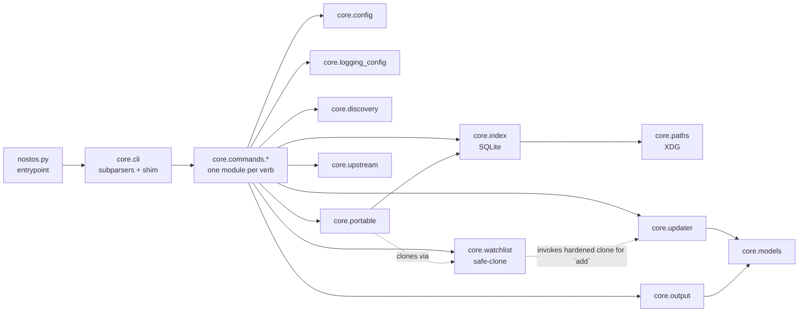
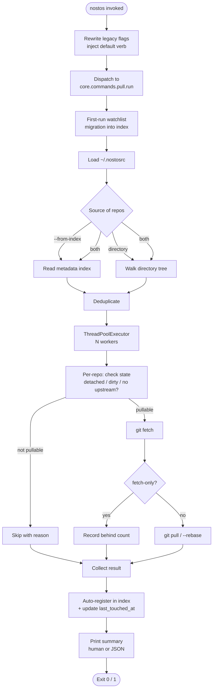
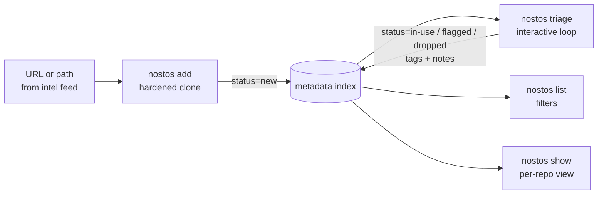
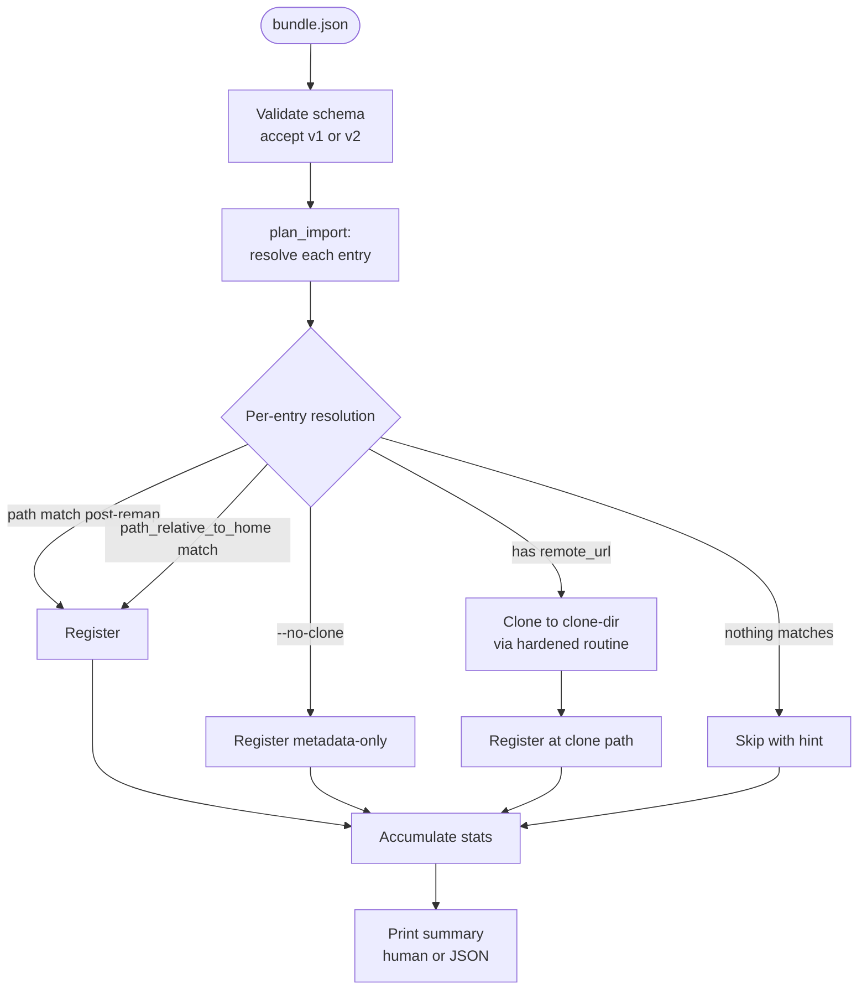

# Architecture

How nostos is organized internally: module layout, dependency graph, and the two most important end-to-end flows.

## Module layout

```
nostos.py                   # thin entrypoint -> core.cli.run
core/
├── cli.py                   # argparse subparsers, legacy flag shim, default-verb injection
├── paths.py                 # XDG-compliant paths ($XDG_CONFIG_HOME / $XDG_DATA_HOME)
├── index.py                 # SQLite metadata index: schema, migrations, CRUD, PRAGMAs
├── config.py                # ~/.nostosrc loader + safety checks
├── discovery.py             # depth-limited directory walk, exclude globs, ownership check
├── logging_config.py        # logs/ setup, rotation, symlink protection
├── models.py                # RepoResult, RepoStatus dataclasses
├── output.py                # human + JSON summaries, ANSI colour handling
├── updater.py               # per-repo pull / fetch, git version guard, SSH multiplexing
├── updater_self.py          # self-update via GitHub releases API
├── watchlist.py             # hardened clone (used by `add`) + legacy watchlist readers
├── portable.py              # export / import bundle (schema v1 + v2)
├── upstream.py              # GitHub / GitLab / Gitea upstream probes
├── auth.py                  # per-host auth token loader for upstream probes
├── vault.py                 # Obsidian vault bridge
├── dashboard.py             # static HTML fleet dashboard
├── digest.py                # weekly changeset report
├── doctor.py                # integrity / health checks
├── taxonomy.py              # MITRE ATT&CK lookup table
└── commands/
    ├── pull.py              # verb: pull (default)
    ├── add.py               # verb: add
    ├── list_cmd.py          # verb: list
    ├── show.py              # verb: show
    ├── tag.py               # verb: tag
    ├── note.py              # verb: note
    ├── triage.py            # verb: triage
    ├── rm.py                # verb: rm
    ├── refresh.py           # verb: refresh (upstream probes)
    ├── digest.py            # verb: digest
    ├── dashboard.py         # verb: dashboard
    ├── vault.py             # verb: vault
    ├── export_cmd.py        # verb: export
    ├── import_cmd.py        # verb: import
    ├── update.py            # verb: update (self-update)
    ├── doctor.py            # verb: doctor
    ├── attack.py            # verb: attack
    ├── completion.py        # verb: completion
    └── _common.py           # shared helpers (error reporter, watchlist migration)
```

## Module dependencies



## Run flow: `nostos pull`



## Intake flow: `nostos add` -> `triage`



## Import flow: `nostos import` with clone-on-import



## Key design constraints

- **No telemetry, no background network.** Network calls happen only when the operator invokes a verb that needs them (`refresh`, `update --check`, clone-on-import, `add` with a URL).
- **Local-first state.** Config, index, logs, and vault all live under the operator's home / XDG dirs. The bundle format is the only sanctioned transport between machines.
- **Thread-safe SQLite.** The index uses WAL mode and a short busy_timeout so the pull command's worker pool can update `last_touched_at` concurrently.
- **Graceful shutdown.** SIGINT flips a `threading.Event`; in-flight workers finish their current repo and nothing new starts.
