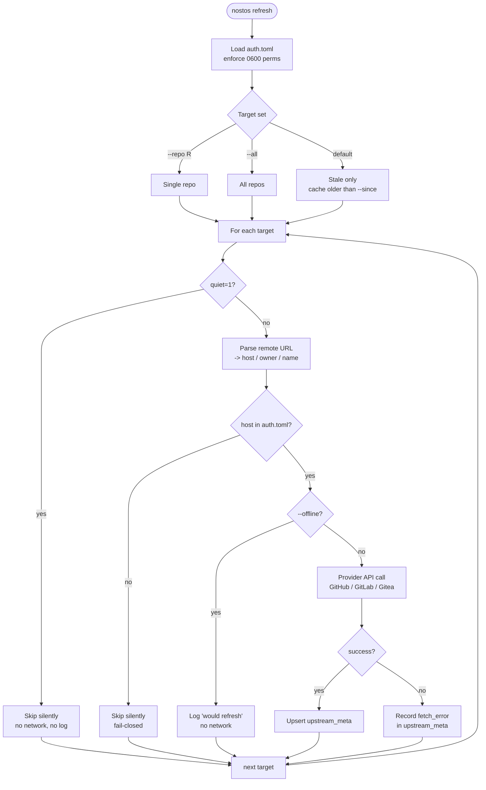

# Upstream probes

`nostos refresh` populates a cached snapshot of each repo's **upstream** health into the index: stars, forks, open issues, archived status, default branch, license, last push, latest release. The snapshot lives next to the repo row in the `upstream_meta` table and has a configurable TTL (default 7 days).

Everything here is **opt-in and fail-closed by default**. A fresh install with no `auth.toml` issues zero outbound calls; `refresh` simply reports that every repo was skipped because its host is not authorised. That is the correct behaviour - nostos will never enumerate your full toolchain to a third party it has not been explicitly told about.

## Supported providers

| Provider | Hosted | Self-hosted | API base |
| --- | --- | --- | --- |
| GitHub | `github.com` | GHE (Enterprise) | `/api/v3` on GHE |
| GitLab | `gitlab.com` | any host | `/api/v4` |
| Gitea | - | any host | `/api/v1` |

For `github.com` and `gitlab.com` the provider is inferred. For every other host you must set `provider = "github"` / `"gitlab"` / `"gitea"` explicitly in `auth.toml`; nostos never guesses.

## Auth config: `~/.config/nostos/auth.toml`

Created automatically under `0700` inside `$XDG_CONFIG_HOME/nostos/`. The file itself **must** be `0600` and owned by the invoking user; otherwise nostos refuses to read it.

```toml
[hosts."github.com"]
token_env = "GITHUB_TOKEN"          # preferred: source from env var

[hosts."gitlab.com"]
token_env = "GITLAB_TOKEN"

[hosts."git.internal.corp"]
provider  = "gitlab"                # required for non-standard hosts
token_env = "CORP_GITLAB_TOKEN"

[hosts."gitea.lab.local"]
provider  = "gitea"
token_env = "HOMELAB_GITEA_TOKEN"

[defaults]
allow_unknown = false               # keep fail-closed; true lets unconfigured
                                    # hosts be probed unauthenticated
```

- `token_env` is always preferred over inline `token`. A token rotates with the environment and never ends up in the file.
- Unknown hosts are skipped unconditionally unless `defaults.allow_unknown = true`.
- Tokens are sent as `Authorization: Bearer <token>` and are **never** logged or included in error messages (verified by test).

## Commands

```bash
# Default: refresh stale (>7d) cache entries for configured hosts only
nostos refresh

# Refresh every registered repo regardless of cache age
nostos refresh --all

# Refresh one repo
nostos refresh --repo ~/tools/recon-kit

# Change the TTL window
nostos refresh --since 30

# Hard kill switch - zero network traffic, prints what would be refreshed
nostos refresh --offline

# JSON summary for scripting
nostos refresh --json
```

## Probe flow



## Operational questions you can answer

```bash
# What did upstream archive recently?
nostos refresh --all --json | jq -r '.errors[] | .path'   # errors first
nostos list --upstream-archived

# Which of my tools upstream has been dormant for more than a year?
nostos list --upstream-dormant 365

# What's in my index but has never been probed?
nostos list --upstream-stale 0

# Check one tool's full state (local + upstream) at a glance
nostos show org/name
```

## Opsec invariants

Stated precisely because these are load-bearing for red-team use:

1. A host that does **not** appear in `auth.toml` is never contacted (unless `allow_unknown = true`).
2. A repo with `quiet = 1` is never probed, never logged at info level.
3. `--offline` produces zero outbound traffic and never fails open if the flag is misread.
4. Tokens live in environment variables by default; when inline, they are still excluded from every log path (`ProbeError.args` and `__str__` both verified by test).
5. The auth file is rejected if its permissions are not `0600` or if it is not owned by the invoking user on Unix.
6. No aggregate metrics, telemetry, or third-party analytics. The only network traffic leaves the machine towards the providers you have explicitly authenticated.
